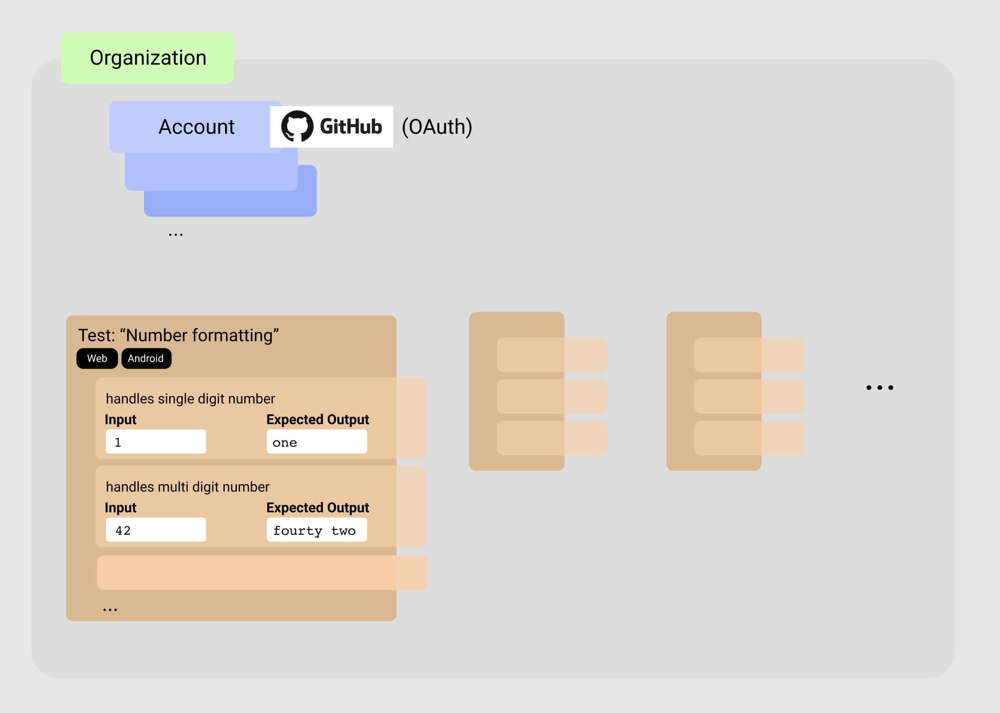

<h1 align="center">Socratest</h1>
<h4 align="center">A platform for managing multiple test cases.</h4>
<h4 align="center" style="margin-bottom: 48px">✏️ Provides automated tests via CLI in multiple languages.</h4>

## Basic Features

> NOTE: **This project is WIP.** 🏃 Design details or implementation could be changed while the project proceeds.

### Test case management

- A **user** can create an **account**, which will support authentication via GitHub OAuth. (also, possibly Google or custom authentication with email/password.)
- An **organization** can be created. Users can join into multiple organizations. Organizations can consist of multiple users. Possibly, there is a limit for maximum users who could join an organization.
- An organization can manage multiple **tests**. A test can contain multiple **test cases**. A test case consists of an **input** and an **expected output**. The input and output will be formatted as plain strings, which should be parsed appropriately by toolkit provided for supported language. Then, the target function in some language should produce an output equal to the expected output when given the input. The test case should only contain input and expected output for single execution of the target function. (i.e. You cannot specify multiple parameters and return values in a single test case: this should be done using multiple test cases.)
- Test cases can have multiple **tags**, which implies that the CLI will support an option to specify a set of tests to execute in a run. This option will be implemented with tags.
- A limit will be applied to max number of tests that an organization can manage, max number of test cases that a test can contain, and maximum size of input and expected output for each test case.

<p align="center">
  
</p>

### Automated tests via CLI, in multiple languages

A **CLI tool** for Socratest will be implemented. This tool manages everything about downloading, managing, and executing the test cases.

The project should only specify the settings, like follows:

```json
// .socratestrc.json
{
  "apiKey": "***", // an api key for organization
  "language": "javascript",

  "targets": [
    {
      "test": "Number formatting",             // this specifies the name of the test
      "function": "./src/utils/Number.format", // this specifies the function to run(located at module ./src/utils/Number.js, and exported with name "format")
    },

    // I don't know how target functions could be specified in other languages 🤔
    ...
  ],

  "include": {
    "tags": ["Web"] // can specify the test set: in this case only tests with tag "Web" will be executed
  },
  "exclude": {
    "tests": ["Some Test Name"] // also, an option will be provided to exclude specific tests identified by its name or tag
  }
}
```

Adapaters parse the input (which is a plain string) into function parameters, and stringify the output from target function back into plain text. Adapters should be implemented in each target language, **which will be provided and applied** by Socratest. Hence, the user need not to manage how test cases are piped into the target function.

Plain text outputs generated by adapters are compared with expected outputs of test cases. The CLI will determine whether the output from target functions matches the expected outputs, and print the result into console (or to a log file). An execution of a set of test cases will result a return code, where a non-zero return code will be generated if the test fails. (This will allow integration of Socratest into CI process, so that the process can be aborted with failing tests.)

Adapaters for each language should handle dependencies appropriately: that is, using Typescript, Babel (for example, when using JS) should not be a problem at all. It should be able to run tests with simple configuration.

### (Optional) Benchmark code editing

It should be tedious to write and save test cases manually. In dashboard, a user could write a **benchmark code** for each test. Then, the benchmark code will generate expected outputs for each input.

Some tools for generating inputs (e.g. random inputs, etc) could be also provided as an option.

## License

See [LICENSE.md](https://github.com/inhibitor1217/socratest/blob/main/LICENSE).
